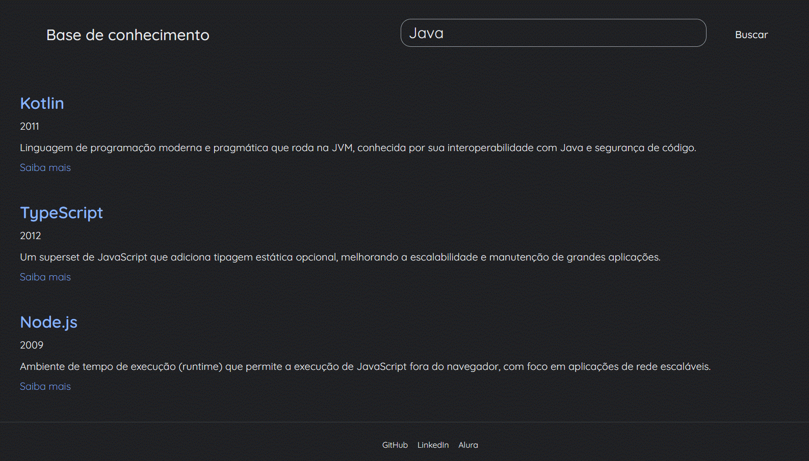

# 📚 Base de Conhecimento de Tecnologias


Projeto desenvolvido durante a 10ª edição da **Imersão Dev** da Alura. Trata-se de uma página web interativa que funciona como uma base de conhecimento, permitindo visualizar e buscar informações sobre diversas tecnologias de programação, como linguagens, frameworks e bancos de dados.

## 🖼️ Demonstração

 
*(Sugestão: grave um GIF ou tire um print da tela da sua aplicação funcionando e adicione ao projeto com o nome `demonstracao.gif`)*

## ✨ Funcionalidades

- **Listagem de Tecnologias**: Exibe cards com informações sobre várias tecnologias, carregadas a partir de um arquivo JSON.
- **Busca Dinâmica**: Filtra as tecnologias em tempo real conforme o usuário digita no campo de busca. A busca é feita pelo nome ou pela descrição.
- **Links Externos**: Cada card possui um link "Saiba mais" que direciona para a página oficial da tecnologia.

## 🚀 Tecnologias Utilizadas

O projeto foi construído utilizando tecnologias web padrões:

- **HTML5**: Para a estrutura semântica da página.
- **CSS3**: Para a estilização dos componentes, cards e layout.
- **JavaScript**: Para a manipulação do DOM, interatividade, consumo de dados e lógica de busca.

## 📂 Estrutura do Projeto

```
base-de-conhecimento/
├── 📄 index.html      # Arquivo principal da aplicação
├── 🎨 style.css        # Folha de estilos
├── ⚙️ script.js        # Lógica de fetch e busca
└── 📦 data.json        # Banco de dados com as tecnologias
```

## 🏃 Como Executar o Projeto

Como o projeto utiliza a API `fetch` do JavaScript para carregar o arquivo `data.json`, ele precisa ser executado a partir de um servidor local para funcionar corretamente (abrir o `index.html` diretamente no navegador pode gerar um erro de CORS).

Siga uma das opções abaixo:

### 1. Usando a extensão Live Server (VS Code)

1.  Instale a extensão Live Server no Visual Studio Code.
2.  Clique com o botão direito no arquivo `index.html`.
3.  Selecione a opção "Open with Live Server".

### 2. Usando Python

Se você tiver Python instalado em sua máquina, pode iniciar um servidor simples:

1.  Abra um terminal na pasta raiz do projeto.
2.  Execute o comando: `python -m http.server`
3.  Abra o seu navegador e acesse `http://localhost:8000`.

## 👨‍💻 Autor

Este projeto foi desenvolvido por **Christian Stoffel** como parte da Imersão Dev da Alura.

- **GitHub**: @christianstoffel
- **LinkedIn**: Christian Stoffel

